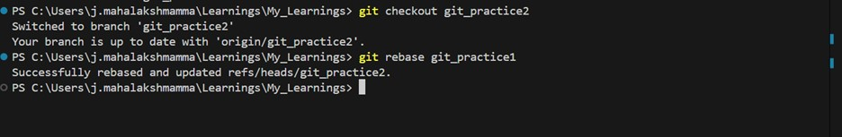
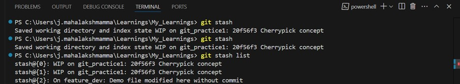
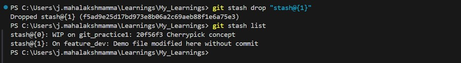
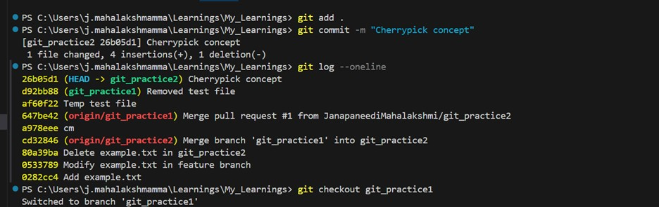
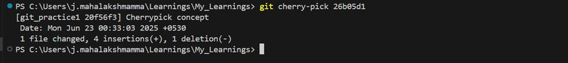

# ADVANCED TOPICS

## REBASE:
git rebase is a Git command used to move or combine a sequence of commits to a new base commit. It’s often used to make your commit history cleaner and more linear, especially before merging.

### Why Use Git Rebase?
- To avoid messy merge commits.
- To clean up your feature branch before merging.
- To stay updated with the latest changes from the base branch.

### Steps
- Checkout the branch we want to rebase.
    - git checkout feature
- Run rebase onto the target branch
    - git rebase main
- If there are conflicts:
    - Resolve the conflict in the files manually.
    - Mark the conflict as resolved: git add <filename>
    - Continue rebase: git rebase --continue
- If something is wrong, abort the rebase
    - git rebase --abort 
- After rebase, if the branch was already pushed, force-push the updated branch
    - git push --force

## STASH:
git stash temporarily saves your uncommitted changes (both staged and unstaged) and gives you a clean working directory.

### It's useful when:
- You need to switch branches but aren’t ready to commit.
- You want to pull the latest code but don’t want to lose your changes.

### Steps:
- Make some changes in working directory 
- Stash the changes 
    -  git stash
- For viewing stashes
    - git stash list
- To apply the recent stash
    - git stash apply
- To remove the stash 
    - git stash pop
- To apply a specific stash 
    - git stash apply stash@{1}
- To delete a specific stash 
    - git stash drop stash@{0}
- To clear all stashes
    - git stash clear

## CHERRYPICK:
git cherry-pick is a Git command used to apply a specific commit from one branch onto another branch.
In merge or rebase we will work with multiple commits, cherry-pick takes one (or more) exact commits and applies them where you are now.

### Steps:
- Checkout the branch where you want the commit
- Find the commit hash you want to cherry-pick by using git log command
- Cherrypick the commit
    - git cherry-pick [commit hash]
- Resolve conflicts, if occurs
- Abort the cherrypick if we want to cancel that.
    - git cherry-pick --abort

