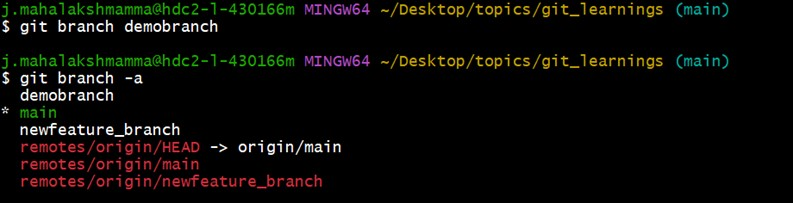
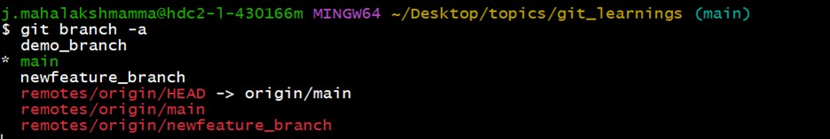
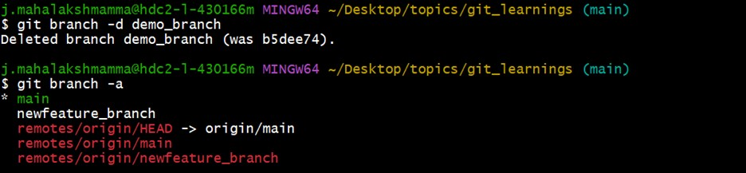
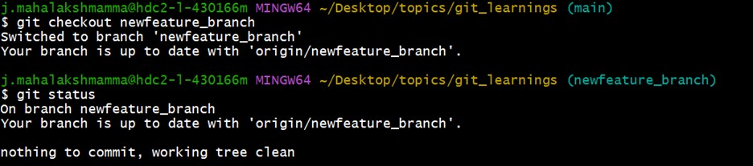

# Branching

Branching allows you to work on different versions of your project simultaneously.  

## Create a Branch:
For example, you can create a branch for a new feature and switch back to the main branch to fix a bug.
#### Syntax
Create a branch:  $ git branch feature-branch 

## Rename a Branch:
#### Syntax
Rename a branch: $ git branch -m old-branch new-branch 

## Delete a Branch:
#### Syntax
Delete a branch: $ git branch -d feature-branch

## How to Switch Between Branches?

Git allows you to move from your current branch to another existing branch.  
If the branch doesn't exist yet, you can create it and switch to it at the same time.

#### Syntax
To switch to another branch: $ git checkout branch-name

