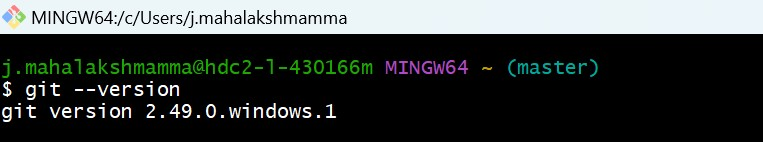
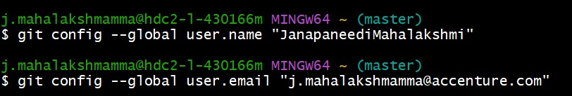
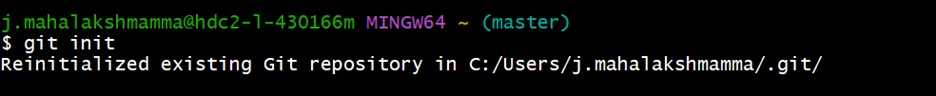
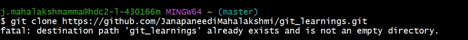
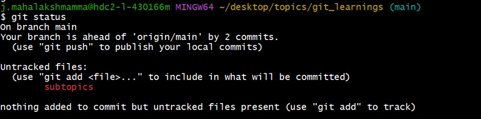
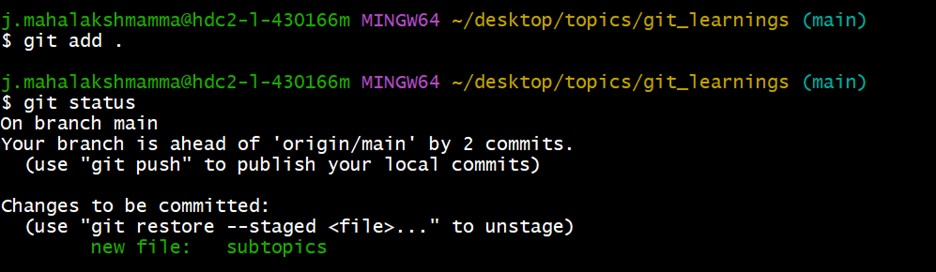
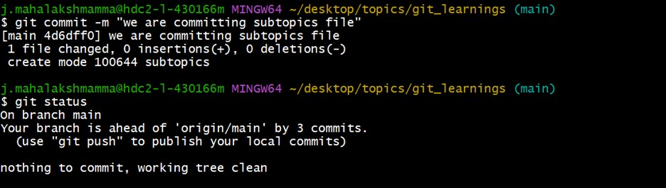
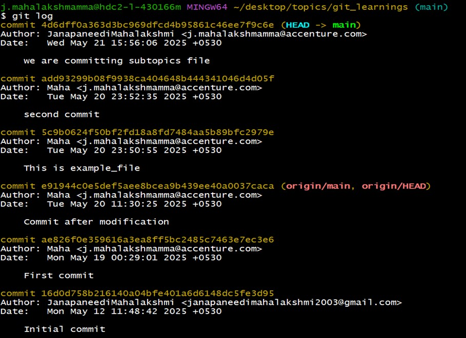
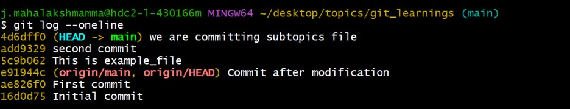
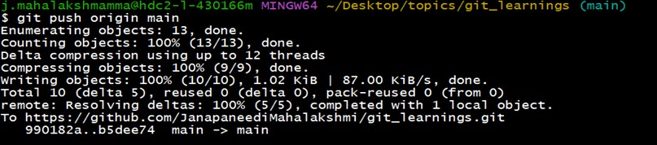

#  Git

##  What is Git?

Git is a popular **version control system**. It is used for:

- Tracking code changes  
- Tracking who made changes  
- Coding collaboration  

---

##  Key Git Concepts

- **Repository**: A folder where Git tracks your project and its history.  
- **Clone**: Make a copy of a remote repository on your computer.  
- **Stage**: Tell Git which changes you want to save next.  
- **Commit**: Save a snapshot of your staged changes.  
- **Branch**: Work on different versions or features at the same time.  
- **Merge**: Combine changes from different branches.  
- **Pull**: Get the latest changes from a remote repository.  
- **Push**: Send your changes to a remote repository.  

---

##  Git Best Practices

- **Commit Often**  
  Make frequent commits with small, focused changes. This makes it easier to roll back specific changes if something breaks.

- **Write Clear Commit Messages**  
  Your commit messages should explain what you changed and why. Use a clear and consistent format so others can easily understand your updates.

- **Use Branches**  
  Never work directly on the `main` branch. Create separate branches for features, fixes, or experiments.

- **Pull Before You Push**  
  Before you push your changes to the remote repository, pull the latest version to avoid conflicts.

- **Review Changes Before Committing**  
  Before committing, take a quick look at what you’re about to save.

- **Keep Repositories Small**  
  Avoid pushing large or unnecessary files. Repos stay cleaner and faster that way.

- **Use `.gitignore`**  
  Tell Git which files to ignore using a `.gitignore` file.  
  Common things to ignore: environment files, dependencies, build folders, logs, etc.

---

##  Git Basic Commands

### `git version`  
Shows the installed Git version.

### `git config`  
Used to set and get Git settings like username, email, editor, etc.

### `git init`  
Initializes a new Git repository in the current directory.

### `git clone`  
Copies an existing Git repository (usually from GitHub) to your local machine.

### `git status`  
Shows the current state of the working directory and staging area.
  

-----

**Staging area**: Where you place changes (with `git add`) to prepare them for the next commit.

###  Tracked vs Untracked Files

- **Tracked files**  
  Files that Git is already tracking. They can be:
  - Unmodified (no changes)
  - Modified (changed but not staged)
  - Staged (ready to be committed)

- **Untracked files**  
  Files in your folder Git doesn’t know about yet. Use `git add <filename>` to start tracking.

-----

### `git add`  
Adds changes to the staging area.

git add filename       # Adds one file
git add .              # Adds all changes in the current directory
git add *.txt          # Adds all .txt files

### `git commit`

`git commit` records the **staged changes** in the repository with a message describing the update.

###  Syntax
git commit -m "Your message"

•	We can also add & commit at same time   git commit -a -m "Any message"
•	-a  Automatically stages all tracked, modified files (no need to run git add for them).
•	-m "Any message" → Adds your commit message directly in the command

### `git log`
The `git log` command shows the commit history of the repository, including commit messages, authors, and dates.

### `git log --oneline`
This version of `git log` displays the commit history in a compact format, with each commit on a single line showing the short commit ID and message.

### `git push`
The `git push` command is used to transfer or push the commit, which is made on a local branch in your computer, to a remote repository like GitHub.

