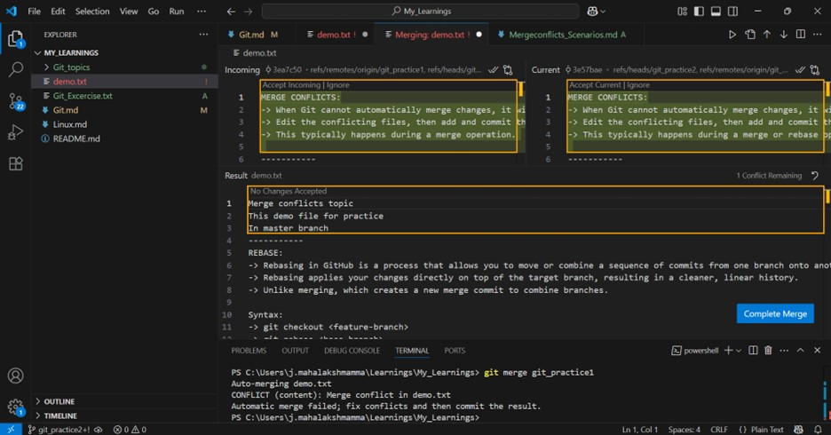

# MERGING
Merging combines changes from one branch into another.You can merge a feature branch into the main branch.

## MERGE CONFLICTS:
- Merge conflicts occur when Git is unable to automatically reconcile differences between branches during a merge.
- This typically happens when changes overlap in a way that Git cannot determine which change to keep.

## Common Merge Conflict Scenarios:
1. Same Line Edited in Two Branches
2. File Deleted in One Branch, Modified in Another
3. New File Added in Both Branches With Same Name
4. Changes Made After a Rebase

## Same Line Edited in Two Branches
- Initialize a Git Repository
- Create a file and make the first commit

- Create and Switch to new branch and edit the same file and commit it.

- When we merge new branch into old branch we will observe merge conflict.

- Resolve the Conflict.

## File Deleted in One Branch, Modified in Another
- In main branch create a file and commit it.
- Create and Switch to new branch and modify it.
- Again checkout to main branch and delete the file created and checkout to feature branch.
- we will the conflict while merging the main branch.
- Resolve the merge conflict by choosing to either keep, delete, or manually edit the file.

